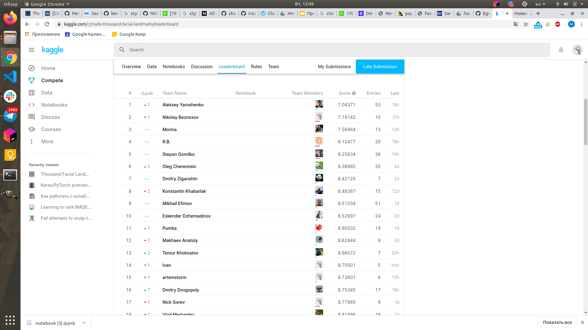

# CV

# Что попробовал

1) Заменил resnet18 на resnet152, у которого заморозил layer1, layer2, layer3, а layer4 разморозил, я это сделал чтобы модель можно было обучать на GPU, иначе batch получался слишком маленьким.

2) Пытался заменить предобработку данных: сначала масштабировать большую сторону к CROP_SIZE, а потом добавлять padding. Но что-то это плохо заработало.

3) Пытался заменить MSE loss на SmoothL1Loss, но это было ошибкой, так как скор на kaggle считается как MSE. Да и результаты стали странными.

4) Добавил к модели новый слой CoordConv, который добавляет в сеть новую информацию о координатах. По идее это должно сильно помочь нейронной сети предсказывать координаты, но помогло не так сильно. Наверное надо было дольше учить.

