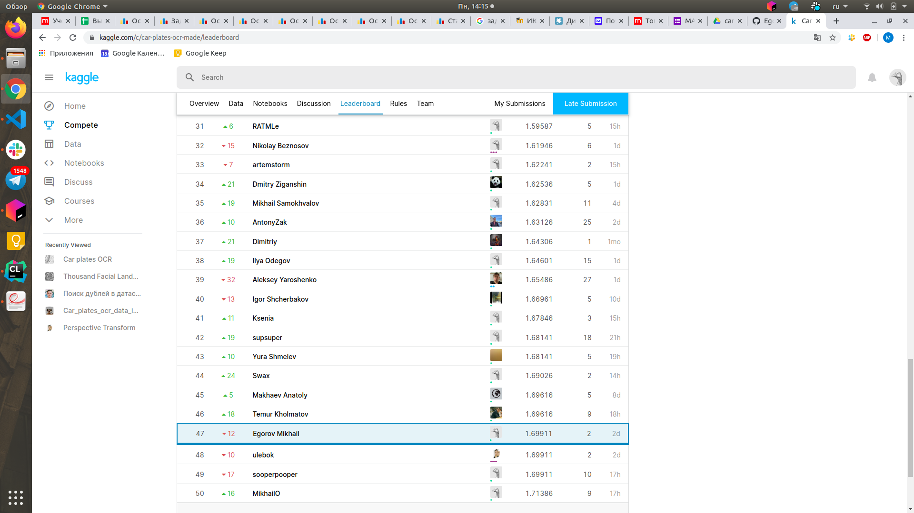

# CV

# Что попробовал

1) В качестве основы взял ноутбук https://www.kaggle.com/alyar88/maskrcnn-bb-x-mask-crnn-0-53

2) Для детекции используется архитектура MaskRCNN с backbone ResNet50. Эта модель одновременно предсказывает прямоугольные bounding box-ы и делает instance segmentation. Чтобы получить итоговые границы номеров на тестовой выборке, нужно аппроксимировать предсказанные маски сегментаций четырехугольником, перед этим я ещё делаю Non Maximum Supression, чтобы избавиться от множественного срабатывания на одном номере.

3) Для распознавания используется архитектура  RCNN с семинара с backbone ResNet18. Добавил различные аугментации, которые слегка портят картинку, но оставляют текст читаемым.

